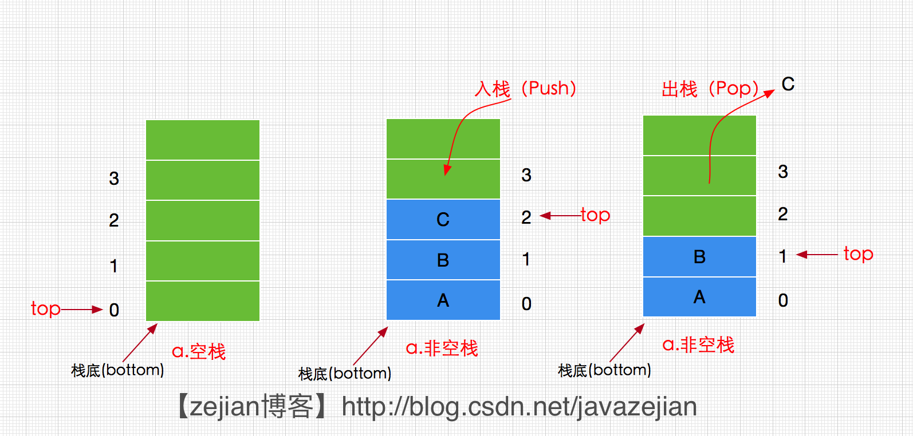

数据结构相关笔记
==
## 栈

> 来自[csdn博客](https://blog.csdn.net/javazejian/article/details/53362993)的介绍

栈满足先进后出规则，并且在实现的时候只操作栈顶元素，因此效率比较高。
``` java
public interface Stack<T> {

    /**
     * 判断是否为空栈
     * @return 是否为空栈
     */
    boolean isEmpty();

    /**
     * 入栈
     * @param t 入栈元素
     */
    void push(T t);

    /**
     * 获取栈顶元素，未出栈
     * @return 栈顶元素
     */
    T peek();

    /**
     * 出栈 返回栈顶元素
     * @return 栈顶元素
     */
    T pop();
}
```
根据内部存储数据的方式不同，分为顺序栈（以数组或者存储数据）和链式栈（以链表），其中对于顺序栈，需要主要在实现时注意top指针的移动并且需要进行数组扩容。而对于链式栈，需要在push的时候考虑有可能因为pop吧原的空栈底出栈导致栈底为空的情况
### 栈的应用
- 符号匹配
- 中缀表达式转换为后缀表达式
- 计算后缀表达式
- 实现函数的嵌套调用
- HTML和XML文件中的标签匹配
- 网页浏览器中已访问页面的历史记录
下面简要说一下

- 符号匹配主要引用于计算字符串表达式，设定一系列的出入栈规则，当遇到左括号时入栈，遇到右括号的时候出栈下面是主要代码节选
``` java
int i=0;
      while(i<expstr.length())
      {
          char ch=expstr.charAt(i);
          i++;
          switch(ch)
          {
              case '(': stack.push(ch+"");//左括号直接入栈
                  break;
              case ')': if (stack.isEmpty() || !stack.pop().equals("(")) //遇见右括号左括号直接出栈
                  return "(";
          }
      }
```
