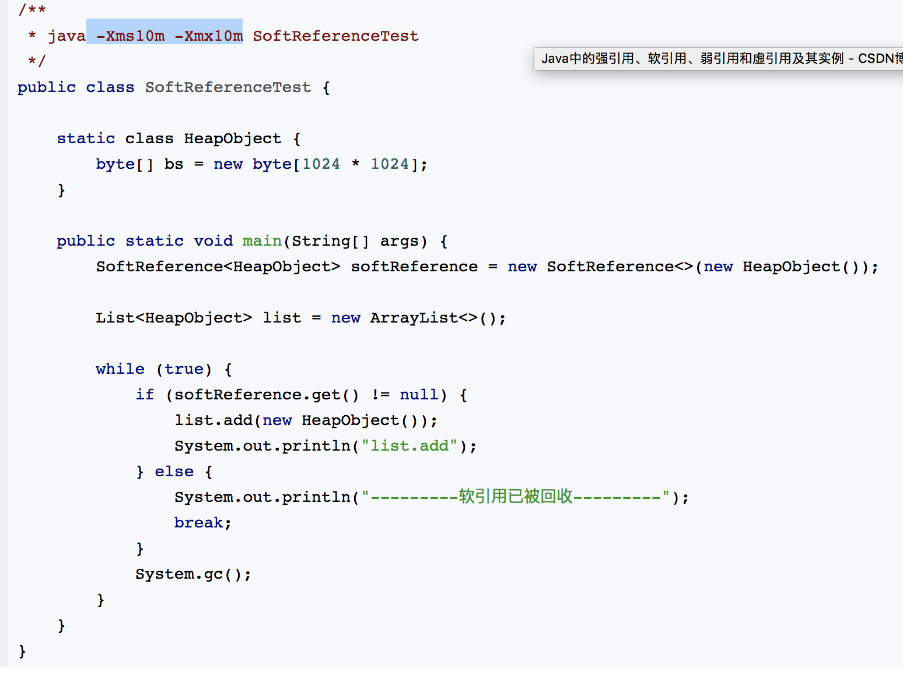

# synchronized锁为什么是非公平锁
要求当一个线程竞争某个对象锁时，只要这个锁的等待队列非空，就必须把这个线程阻塞并塞入队尾（插入队尾一般通过一个CAS保持插入过程中没有锁释放）。相对的，非公平锁场景下，每个线程都先要竞争锁，在竞争失败或当前已被加锁的前提下才会被塞入等待队列，在这种实现下，后到的线程有可能无需进入等待队列直接竞争到锁。

# volatile
 无法替代synchronized 因为volatile中出现符合操作时，无法保证从主内存中重新获取数据，但是能够保证指令重排序，复合操作：直接赋值 与 读取，（+1？）加一，写入 增加了一步，导致会有损失。

# http
当你输入一个网址并按下回车键的时候，首先，应用层协议对该请求包做了格式定义；紧接着传输层协议加上了双方的端口号，确认了双方通信的应用程序；然后网络协议加上了双方的IP地址，确认了双方的网络位置；最后链路层协议加上了双方的MAC地址，确认了双方的物理位置，同时将数据进行分组，形成数据帧，采用广播方式，通过传输介质发送给对方主机。而对于不同网段，该数据包首先会转发给网关路由器，经过多次转发后，最终被发送到目标主机。目标机接收到数据包后，采用对应的协议，对帧数据进行组装，然后再通过一层一层的协议进行解析，最终被应用层的协议解析并交给服务器处理。

# final finally finalize
## final修饰类、方法、变量
    当修饰类的时候，便是该类不可以继承扩展，
    当修饰变量时，该变量不可修改
    当修饰方法时，则该方法不可重写

## finally 
    java保证重点代码一定要被执行的一种机制，可用用try-finally 或者try-catch-finally来进行类似关闭JDBC连接、
    保证unlock等操作

## finalize
    是Object的一个方法，设计的目的是保证对象在被垃圾收集前完成特定的
    资源回收。已经弃用 java9

## final好处：
    在API开发时避免使用者更改基础功能。
    可以用于保护只读取的数据，在并发编程中减少额外的开销，
    也可以省去一些防御性拷贝

# 强引用，软引用，弱引用，幻象引用
+ 1.不同的引用类型，体现的是对象不同的可达性状态和对垃圾
    收集的影响
    强引用：常见普通对象的引用，对于一个普通的对象，
    如果没有其他的引用关系，只要超过了引用的作用域，或显示
    =null，就是可以垃圾收集但是具体收集时机依赖收集策略。

    软引用：只有当jvm认为内存不足的时候，才会尝试去试图
    回收。通常来实现内存敏感。实例 在内存敏感（即可用的
    资源数目有限）时，当超过内存限制时，GC会尝试去回收，
    避免OutOfMemoryError

```java
//软引用例子
public class SoftReferenceTest {
    static class HeapObject {
        byte[] bs = new byte[1024 * 1024];
    }

    public static void main(String[] args) {
        SoftReference<HeapObject> softReference = new SoftReference<>(new HeapObject());
        List<HeapObject> list = new ArrayList<>();

        while (true) {
            if (softReference.get() != null) {
                list.add(new HeapObject());
                System.out.println("list.add");
            } else {
                System.out.println("---------软引用已被回收---------");
                break;
            }
            System.gc();
        }
    }
}
```
```java
public class SoftReferenceQueueTest {

    static class HeapObject {
        byte[] bs = new byte[1024 * 1024];
    }

    public static void main(String[] args) {
        ReferenceQueue<HeapObject> queue=new ReferenceQueue<>();
        SoftReference<HeapObject> softReference = new SoftReference<>(new HeapObject(),queue);

        List<HeapObject> list = new ArrayList<>();

        while (true) {
            if (softReference.get() != null) {
                list.add(new HeapObject());
                System.out.println("list.add");
            } else {
                System.out.println("---------软引用已被回收---------");
                break;
            }
            System.gc();
        }
        //虽然GC了 但是还是能够在软引用队列中重新获取该引用，但是引用的实例已经为null！！
        Reference<? extends  HeapObject> pollRef = queue.poll();
        while (pollRef != null) {
            System.out.println(pollRef);
            System.out.println(pollRef.get());
            pollRef = queue.poll();
        }

    }
}
```
    弱引用：
    类似于软引用，应用场景也类似软引用。
    虚引用：
    get（）永远=null.因此可以根据这个特性
    当GC准备回收一个对象时，发现它还有虚引用，就会在回收前，把虚引用加入到引用队列中，程序可以通过判断队列中是否加入虚引用来判断被引用的对象是否将要GC回收，从而可以在finalize方法中采取措施。

# java反射机制，动态代理基于什么原理
## 反射机制
    是java提供的程序在运行时能够自省，即通过反射我们可以操作类或者对象，比如获取对象的类定义，类声明的属性和方法，调用方法或者构造对象。
##动态代理
    是一种方便运行时构建代理，动态处理代理方法调用的机制。实现的方式有JDK自提供的动态代理，利用了反射机制，还有字节码操作，ASM CGLIB javassist
## 面试问题
    美团面试被问到反射的原理，竟然答不出来，难受，还有因为以前没用过所以基本的问题答错了。。。
#### Class.forName method
##### 官方api
``` java
public static Class<?> forName(String className)
                        throws ClassNotFoundException
Returns the Class object associated with the class or interface with the given string name. Invoking this method is equivalent to:
Class.forName(className, true, currentLoader)
where currentLoader denotes the defining class loader of the current class.
For example, the following code fragment returns the runtime Class descriptor for the class named java.lang.Thread:

Class t = Class.forName("java.lang.Thread")
A call to forName("X") causes the class named X to be initialized.

Parameters:
className - the fully qualified name of the desired class.
Returns:
the Class object for the class with the specified name.
Throws:
LinkageError - if the linkage fails
ExceptionInInitializerError - if the initialization provoked by this method fails
ClassNotFoundException - if the class cannot be located
 ```
##### 具体实例
[例子](https://www.cnblogs.com/luoxn28/p/5686794.html ' 这是一个SB link ') 主要需要知道三个东西RTTI CLASS 类加载器步骤
###### Class对象

Class对象包含了与类有关的信息。每个类都会产生一个对应class对象如以下,这个class对象保存在.class编译后的java文件中。所有类的第一次使用时，动态的加载到JVM中。当程序创建一个对类的静态成员的引用时，就会加载这个类。Class对象仅在需要的时候才会加载。static初始化是在类加载时进行的。
``` java
//不会初始化静态代码块
Class<ReflectTest> reflectTestClass = ReflectTest.class;
//会初始化静态代码块
Class<?> aClass = Class.forName(reflectTestClass.getName());

```
想在运行时使用类型信息，必须获取对象的Class对象的引用，使用功能Class.forName(“Base”)可以实现该目的，或者使用base.class。注意，有一点很有趣，使用功能”.class”来创建Class对象的引用时，不会自动初始化该Class对象，使用forName()会自动初始化该Class对象。为了使用类而做的准备工作一般有以下3个步骤：

- 加载：由类加载器完成，找到对应的字节码，创建一个Class对象
- 链接：验证类中的字节码，为静态域分配空间
- 初始化：如果该类有超类，则对其初始化，执行静态初始化器和静态初始化块。

可参考[《Java编程思想-第4版》类型信息章节](https://love2.io/@webeta/doc/think-in-java/11.3%20反射：运行期类信息.md)


    


